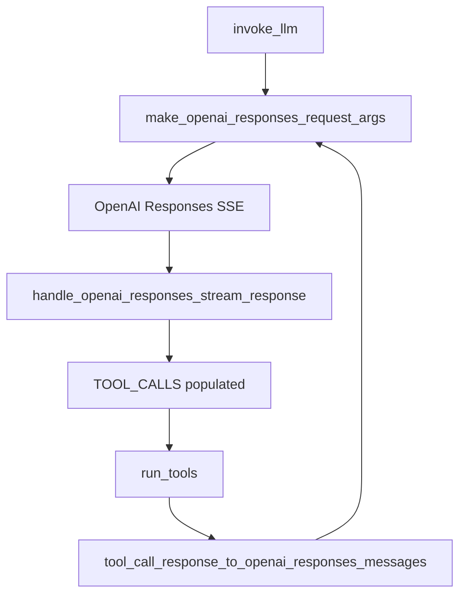

# Architecture

1. New modules
   1. src/buzzllm/subagent.py: call_subagent tool + SSE parsing.
   2. src/buzzllm/subagent_runner.py: subprocess entrypoint; reads JSON; runs invoke_llm SSE.
   3. src/buzzllm/tools/catalog.py: tool name to callable/desc mapping.
2. Existing modules touched
   1. src/buzzllm/tools/utils.py: schema builder helpers for tool subsets.
   2. src/buzzllm/main.py: include call_subagent in tool list when tools enabled.

```mermaid
graph TD
  A[Main invoke_llm] --> B[call_subagent tool]
  B --> C[Subprocess: subagent_runner]
  C --> D[invoke_llm SSE]
  D --> E[SSE stdout]
  E --> B
  C --> F[Tool registry (subset only)]
```

Acceptance
1. Subprocess has isolated TOOL_CALLS and tool registry.
2. Main agent receives only subagent output_text.

## OpenAI Responses Tooling

1. Existing modules touched
   1. src/buzzllm/llm.py: make_openai_responses_request_args, handle_openai_responses_stream_response, tool_call_response_to_openai_responses_messages, invoke_llm input/messages routing.
   2. tests/unit/test_llm_request_args.py, tests/unit/test_llm_stream_handlers.py, tests/unit/test_llm_tool_messages.py.
   3. tests/integration/test_openai_responses_integration.py (new).
2. In-memory state
   1. last_openai_response_id (string) stored during streaming for previous_response_id.
   2. input list buffer for tool_result continuation requests.
3. No new modules; reuse existing ToolCall structure and TOOL_CALLS registry.



Acceptance
1. Responses tool loop uses previous_response_id without affecting chat completions.
2. invoke_llm supports messages and input modes without branching elsewhere.

## Structured Outputs Architecture

1. Existing modules touched
   1. src/buzzllm/llm.py: LLMOptions structured fields, request args (openai-chat, anthropic, vertex), invoke_llm buffering, print_to_stdout output_structured.
2. In-memory state
   1. structured_output_buffer (string) used only when structured output is enabled.
3. StreamResponse type
   1. Add output_structured to StreamResponse.type for SSE.
