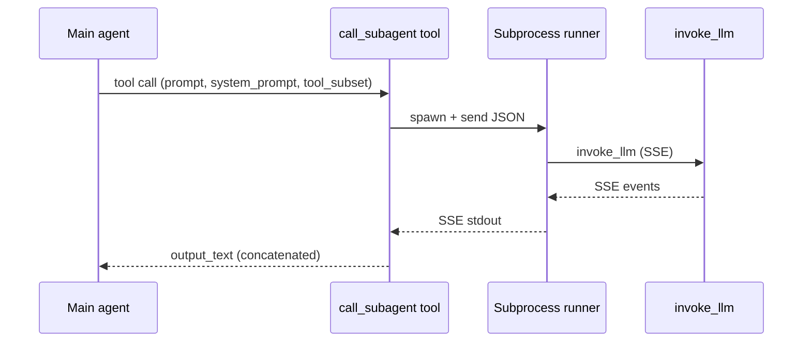
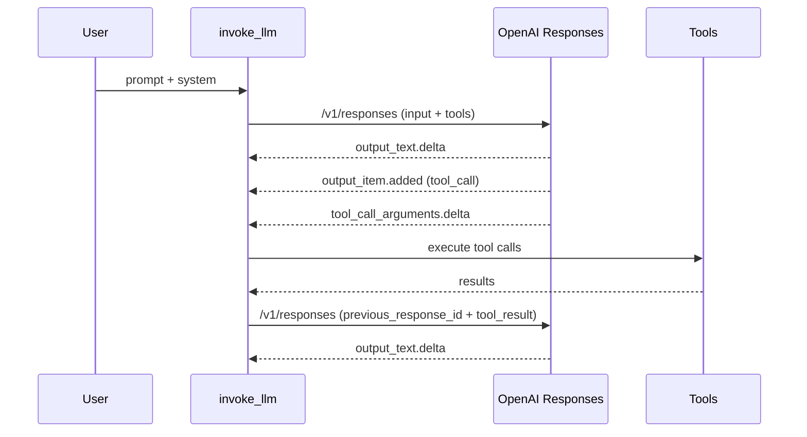
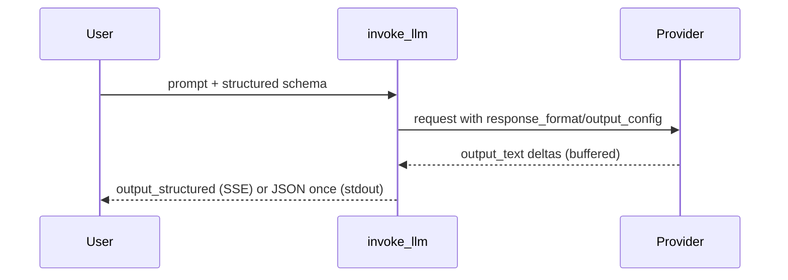

# Flows

1. Main to subagent flow
   1. Main agent calls call_subagent(prompt, system_prompt, tool_subset).
   2. call_subagent builds JSON payload with parent model/provider/url/api_key_name.
   3. call_subagent spawns subprocess runner and parses SSE output_text.
   4. call_subagent returns concatenated output_text to main agent.
2. Tool subset validation flow
   1. tool_subset is validated against catalog names.
   2. If unknown tools exist, return error string without spawning subprocess.
3. Failure flow
   1. If subprocess exits non-zero, return error string containing exit code.

Acceptance
1. call_subagent returns only output_text concatenation.
2. Unknown tool_subset names do not spawn subprocess.

## OpenAI Responses Flows

1. Initial request flow
   1. Build input list with user input_text and optional instructions.
   2. Send responses request with tools + stream enabled.
   3. Stream output_text deltas and reasoning summary (if present).
2. Tool call flow
   1. On response.output_item.added with tool_call, create ToolCall and capture id/name.
   2. On response.tool_call_arguments.delta, append arguments and emit tool_call deltas.
   3. After tool execution, send follow-up with previous_response_id and tool_result input items.
3. Failure flow
   1. If tool execution raises, invoke_llm prints error block_end and exits.
   2. If responses stream emits invalid JSON, ignore that line and continue.

Acceptance
1. Tool call flow works without constructing chat messages.
2. Follow-up request uses previous_response_id from response.created.

## Structured Outputs Flow

1. OpenAI chat flow
   1. Set response_format json_schema or json_object in request args.
   2. Buffer output_text deltas; do not print partial JSON.
   3. On block_end with no tool calls, emit output_structured event or print JSON once.
2. Anthropic/Vertex flow
   1. Set output_config.format json_schema in request args.
   2. Buffer output_text deltas; emit output_structured at end.

